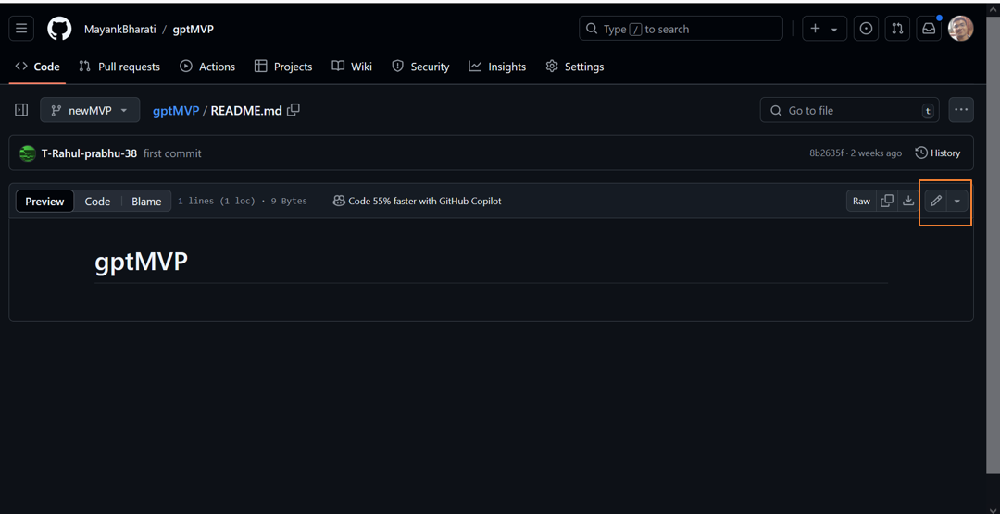

# Contributing to [Project Name]

Thank you for your interest in contributing to *[Project Name]*! This guide explains how you can contribute to the project effectively. You can choose to contribute directly on GitHub via your browser or work locally on your computer.

---

## Table of Contents
1. [Option 1: Contribute Using GitHub (via Browser)](#option-1-contribute-using-github-via-browser)
2. [Option 2: Contribute Locally Using Git](#option-2-contribute-locally-using-git)
3. [Common Errors](#common-errors)

---

## *Option 1: Contribute Using GitHub (via Browser)*

### 1. Fork the Repository
- Navigate to the repository you want to contribute to.
- Click the *Fork* button in the top-right corner of the repository page.
- This creates a copy of the repository in your GitHub account.

  
  

### 2. Create a New Branch
- Go to your forked repository.
- Click the branch dropdown menu (usually labeled main).
- Enter a name for your branch (e.g., add-your-name) and click *Create branch*.
- Creating a new branch ensures your changes are organized and independent.


### 3. Edit the File
- Locate the file you want to modify (e.g., README.md).
- Click the pencil icon in the top-right corner of the file to edit it.
- Make your changes, following the project's style and format.


### 4. Commit Your Changes
- Scroll down to the *Commit changes* section.
- Add a brief and descriptive commit message (e.g., "Added my name to contributors' list").
- Ensure that you commit to your newly created branch.
- Click *Commit changes*.


### 5. Create a Pull Request (PR)
- Navigate to the *Pull Requests* tab in your forked repository.
- Click the *New Pull Request* button.
- Confirm that the base repository is the original project and the base branch is main.  
  Ensure that the head repository is your fork and the branch you created.
- Click *Create Pull Request* and provide a description of your changes.
- Submit the PR and wait for maintainers to review your contribution.


---

## *Option 2: Contribute Locally Using Git*

### 1. Fork the Repository
- Go to the repository on GitHub.
- Click the *Fork* button in the top-right corner to create a copy of the repository in your GitHub account.

### 2. Clone the Repository
- Open your forked repository on GitHub.
- Click the green *Code* button and copy the repository URL (HTTPS or SSH).
- Open a terminal and run:
  ```bash
  git clone <repository-url>
